Bayesian IBNR Model for Cyber Incidents
================

``` r
# Clear the workspace and load necessary libraries
rm(list = ls())
library(nimble)
```

    ## nimble version 1.1.0 is loaded.
    ## For more information on NIMBLE and a User Manual,
    ## please visit https://R-nimble.org.
    ## 
    ## Note for advanced users who have written their own MCMC samplers:
    ##   As of version 0.13.0, NIMBLE's protocol for handling posterior
    ##   predictive nodes has changed in a way that could affect user-defined
    ##   samplers in some situations. Please see Section 15.5.1 of the User Manual.

    ## 
    ## Attaching package: 'nimble'

    ## The following object is masked from 'package:stats':
    ## 
    ##     simulate

``` r
library(coda)
library(doParallel)
```

    ## Loading required package: foreach

    ## Loading required package: iterators

    ## Loading required package: parallel

``` r
library(reshape2)
library(ggplot2)
registerDoParallel(cores = 3)  # Adjust number of cores as needed
```

## Introduction

This R Markdown file provides an implementation of a Bayesian Incurred
But Not Reported (IBNR) model for cyber incidents in the healthcare
industry. The model estimates delayed reporting of incidents based on
historical data.

## Data Preparation

``` r
# Load data and limit to the date range needed
itrc23 <- read.csv("itrc23_healthcare.csv", header = TRUE)[, -1]

# Subset data for the model
breach <- itrc23[1:60, -14]  # 60 rows (time periods), 12 delay periods (we remove the last column, i.e., the delayed month>=12)

# Mask future values for prediction (NA for rows 50-60)
for (i in 50:60) {
  for (j in (63 - i):13) {
    breach[i, j] <- NA
  }
}
```

## Model Setup

This section defines the Bayesian IBNR model using the nimble package.

``` r
# Define constants and data for nimble
y <- breach[, -1]
nT <- 60
nD <- 12
Consts <- list(nT = nT, nD = nD)
nimbleData <- list(y = as.matrix(y))

# Define nimble model code
nbModel <- nimbleCode({
  for (t in 1:nT) {
    for (d in 1:nD) {
      logit(pmatrix[t, d]) <- beta[1] + beta[2] * t + beta[3] * d / nD
      log(lambda[t, d]) <- g[1] + g[2] * t + g[3] * d / nD
      y[t, d] ~ dnegbin(prob = pmatrix[t, d], size =lambda[t,d])
    }
  }

  # Priors for g and beta coefficients
  g[1] ~ dnorm(0, sig[1])
  g[2] ~ dnorm(0, sig[2])
  g[3] ~ dnorm(0, sig[3])
  beta[1] ~ dnorm(0, sig[4])
  beta[2] ~ dnorm(0, sig[5])
  beta[3] ~ dnorm(0, sig[6])
  
  # Exponential priors for sigma
  for (i in 1:6) {
    sig[i] ~ dexp(rate = 1)
  }
})
```

## MCMC Setup and Execution

We run MCMC with three parallel chains for better convergence.

``` r
# Initialize model parameters and data list for nimble
constants <- list(nT = nT, nD = nD)
data_list <- list(y = y)
inits <- list(y = y, g = rnorm(3), beta = rnorm(3), sig = rep(1, 6))

# Compile the model and set up MCMC
model <- nimbleModel(code = nbModel, constants = constants, data = data_list, inits = inits)
```

    ## Defining model

    ## Building model

    ##   [Note] Detected JAGS-style initial values, provided as a list of lists. Using the first set of initial values

    ## Setting data and initial values

    ##   [Note] 'X1m' has initial values but is not a variable in the model and is being ignored.

    ##   [Note] 'X2m' has initial values but is not a variable in the model and is being ignored.

    ##   [Note] 'X3m' has initial values but is not a variable in the model and is being ignored.

    ##   [Note] 'X4m' has initial values but is not a variable in the model and is being ignored.

    ##   [Note] 'X5m' has initial values but is not a variable in the model and is being ignored.

    ##   [Note] 'X6m' has initial values but is not a variable in the model and is being ignored.

    ##   [Note] 'X7m' has initial values but is not a variable in the model and is being ignored.

    ##   [Note] 'X8m' has initial values but is not a variable in the model and is being ignored.

    ##   [Note] 'X9m' has initial values but is not a variable in the model and is being ignored.

    ##   [Note] 'X10m' has initial values but is not a variable in the model and is being ignored.

    ##   [Note] 'X11m' has initial values but is not a variable in the model and is being ignored.

    ##   [Note] 'X12m' has initial values but is not a variable in the model and is being ignored.

    ## Running calculate on model
    ##   [Note] Any error reports that follow may simply reflect missing values in model variables.

    ## Checking model sizes and dimensions

    ##   [Note] This model is not fully initialized. This is not an error.
    ##          To see which variables are not initialized, use model$initializeInfo().
    ##          For more information on model initialization, see help(modelInitialization).

``` r
compiled_model <- compileNimble(model)
```

    ## Compiling
    ##   [Note] This may take a minute.
    ##   [Note] Use 'showCompilerOutput = TRUE' to see C++ compilation details.

``` r
mcmc_config <- configureMCMC(model, monitors = c("g", "beta", "y", "sig"))
```

    ## ===== Monitors =====
    ## thin = 1: beta, g, sig, y
    ## ===== Samplers =====
    ## RW sampler (12)
    ##   - sig[]  (6 elements)
    ##   - g[]  (3 elements)
    ##   - beta[]  (3 elements)
    ## posterior_predictive sampler (66)
    ##   - y[]  (66 elements)

``` r
compiled_mcmc <- compileNimble(buildMCMC(mcmc_config), project = model)
```

    ## Compiling
    ##   [Note] This may take a minute.
    ##   [Note] Use 'showCompilerOutput = TRUE' to see C++ compilation details.

``` r
# Set up parallel processing
num_cores <- detectCores() - 1
registerDoParallel(cores = num_cores)
seed <- c(100,229,3098)

# Run MCMC with parallel chains
chains <- foreach(chain = 1:3, .packages = c("nimble", "coda")) %dopar% {
  # Run the MCMC for each chain
  chain_samples <- runMCMC(compiled_mcmc, setSeed=seed[chain], nchains = 1, nburnin=1e+5,niter=5e+5, thin = 100, samplesAsCodaMCMC = TRUE)
  # Convert to mcmc object
  as.mcmc(chain_samples)
}

# Combine the separate chains into an mcmc.list
samples <- mcmc.list(chains)


# Save MCMC results
save(samples, file = "MCMC_results.RData")
```

## Results Analysis

``` r
# Analyze and visualize results

results1=samples[,c("beta[1]","beta[2]","beta[3]","g[1]","g[2]","g[3]", paste0("sig[", 1:6, "]"))]

summary(results1)
```

    ## 
    ## Iterations = 1:4000
    ## Thinning interval = 1 
    ## Number of chains = 3 
    ## Sample size per chain = 4000 
    ## 
    ## 1. Empirical mean and standard deviation for each variable,
    ##    plus standard error of the mean:
    ## 
    ##             Mean       SD  Naive SE Time-series SE
    ## beta[1] -0.79031 0.268131 2.448e-03      0.0054223
    ## beta[2]  0.01033 0.006457 5.894e-05      0.0001236
    ## beta[3] -0.38278 0.299266 2.732e-03      0.0042184
    ## g[1]     1.20377 0.266249 2.431e-03      0.0053879
    ## g[2]     0.01235 0.005954 5.435e-05      0.0001138
    ## g[3]    -2.96850 0.315930 2.884e-03      0.0045524
    ## sig[1]   0.88297 0.756359 6.905e-03      0.0074748
    ## sig[2]   1.50589 1.221930 1.115e-02      0.0110850
    ## sig[3]   0.28265 0.237503 2.168e-03      0.0021829
    ## sig[4]   1.14396 0.973020 8.882e-03      0.0089900
    ## sig[5]   1.48832 1.223970 1.117e-02      0.0113836
    ## sig[6]   1.34454 1.125406 1.027e-02      0.0108169
    ## 
    ## 2. Quantiles for each variable:
    ## 
    ##               2.5%       25%      50%      75%    97.5%
    ## beta[1] -1.3078119 -0.972444 -0.79452 -0.60630 -0.26415
    ## beta[2] -0.0023270  0.005976  0.01034  0.01477  0.02291
    ## beta[3] -0.9773385 -0.580423 -0.38141 -0.17828  0.20345
    ## g[1]     0.6947931  1.022303  1.19891  1.38224  1.73403
    ## g[2]     0.0006467  0.008329  0.01236  0.01642  0.02398
    ## g[3]    -3.5937900 -3.181772 -2.96827 -2.75156 -2.36020
    ## sig[1]   0.0612250  0.349676  0.68203  1.20656  2.84303
    ## sig[2]   0.1123222  0.608786  1.19360  2.07566  4.62994
    ## sig[3]   0.0199252  0.110355  0.21843  0.38800  0.89566
    ## sig[4]   0.0828398  0.454926  0.88368  1.54623  3.70019
    ## sig[5]   0.1051663  0.590932  1.16898  2.03112  4.68782
    ## sig[6]   0.0905340  0.530841  1.05411  1.81735  4.33950

``` r
# Traceplot for convergence diagnostics
#pdf("trace_plots.pdf")
traceplot(results1)
```

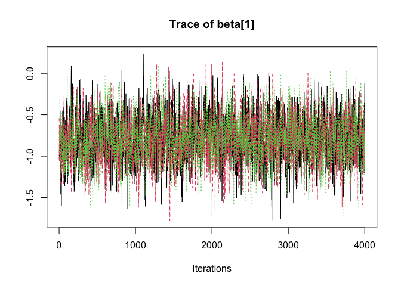<!-- -->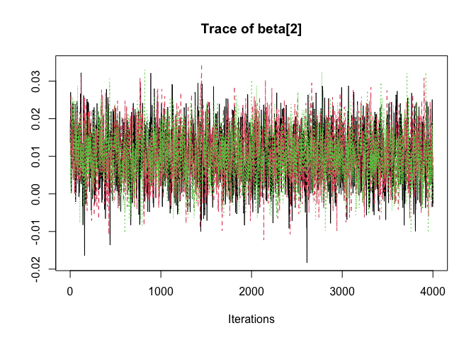<!-- -->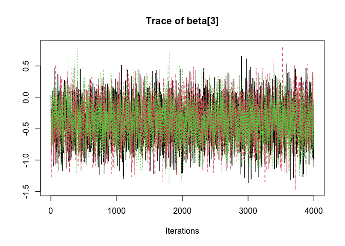<!-- -->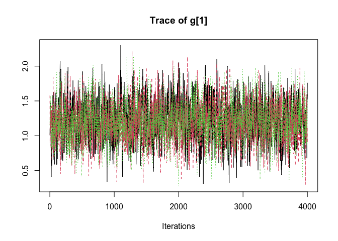<!-- -->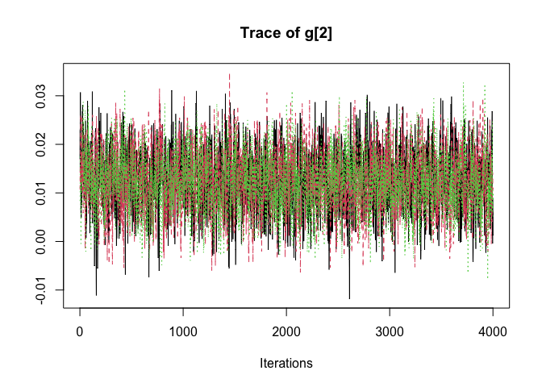<!-- -->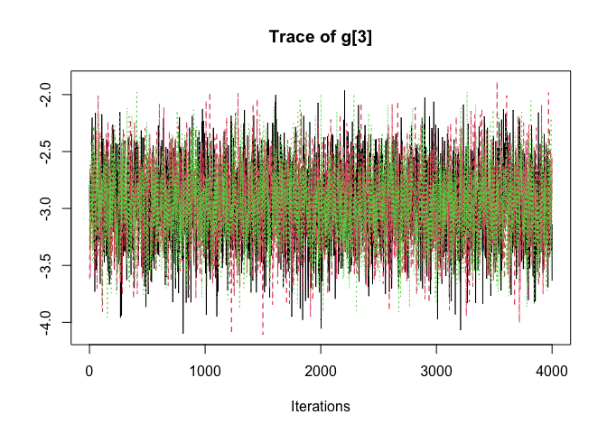<!-- -->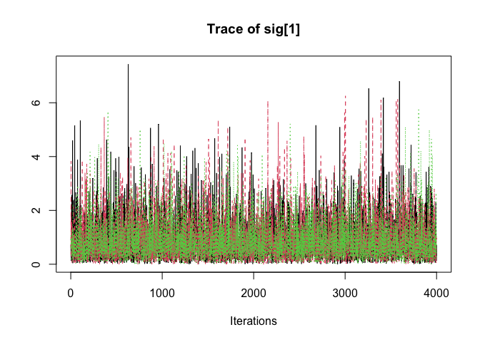<!-- -->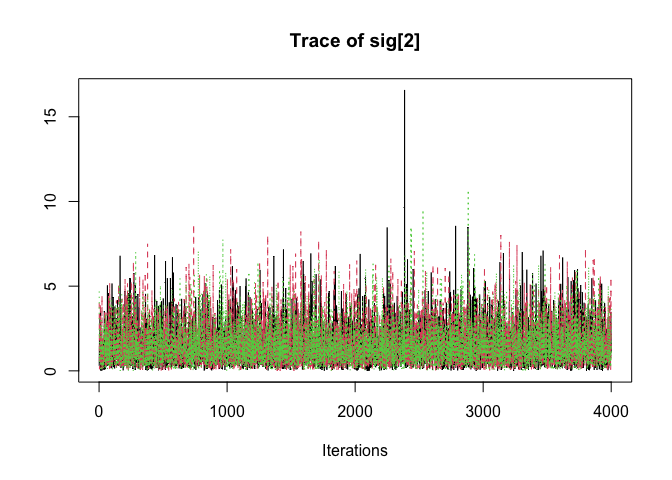<!-- -->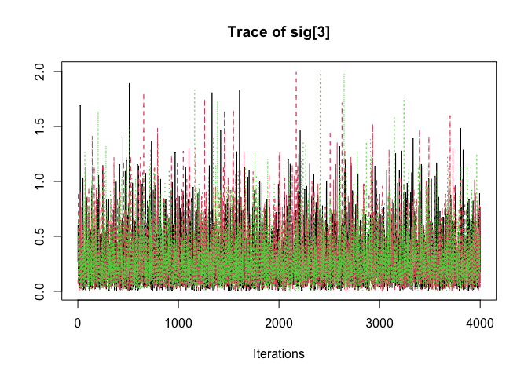<!-- -->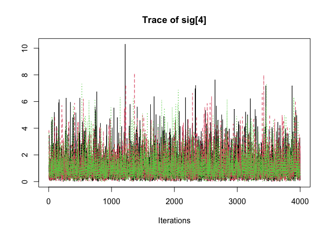<!-- -->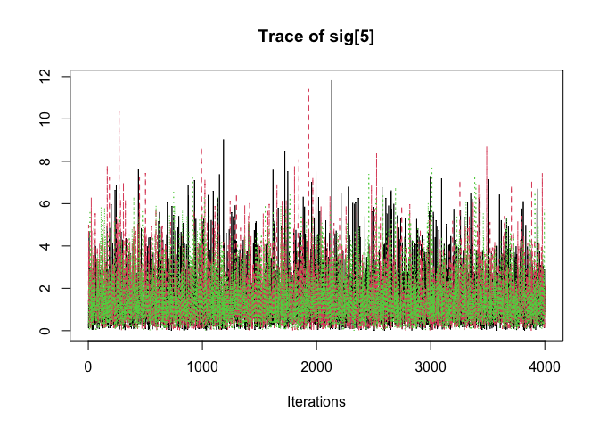<!-- -->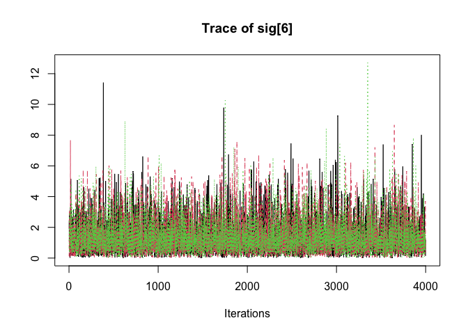<!-- -->

``` r
#dev.off()

# Gelman-Rubin diagnostic
rhat <- gelman.diag(results1)
print(rhat)
```

    ## Potential scale reduction factors:
    ## 
    ##         Point est. Upper C.I.
    ## beta[1]          1          1
    ## beta[2]          1          1
    ## beta[3]          1          1
    ## g[1]             1          1
    ## g[2]             1          1
    ## g[3]             1          1
    ## sig[1]           1          1
    ## sig[2]           1          1
    ## sig[3]           1          1
    ## sig[4]           1          1
    ## sig[5]           1          1
    ## sig[6]           1          1
    ## 
    ## Multivariate psrf
    ## 
    ## 1

## Posterior Prediction

``` r
# Create an array for posterior predictions
sims.matrix <- do.call(rbind.data.frame, samples)
n.sims <- nrow(sims.matrix)
y_pred_array <- array(dim = c(n.sims, nT, nD))

# Generate predictions for masked future values
for (t in 50:60) {
  for (d in (62 - t):12) {
    y_pred_array[, t, d] <- sims.matrix[[paste0("y[", t, ", ", d, "]")]]
  }
}
```

## prediction matrix

``` r
# Initialize prediction matrices
pred_median<-breach[,-1]
pred_mean <- pred_median
pred_lower95 <- pred_median
pred_upper95 <- pred_median
pred_upper99 <- pred_median
pred_lower99 <- pred_median

# Populate prediction matrices with quantiles and means from posterior samples
for (i in 50:60) {
  for (j in (62 - i):12) {
    pred_median[i, j] <- median(y_pred_array[, i, j], na.rm = TRUE)
    pred_mean[i, j] <- mean(y_pred_array[, i, j], na.rm = TRUE)
    pred_lower95[i, j] <- quantile(y_pred_array[, i, j], 0.025, na.rm = TRUE)
    pred_upper95[i, j] <- quantile(y_pred_array[, i, j], 0.975, na.rm = TRUE)
    pred_lower99[i, j] <- quantile(y_pred_array[, i, j], 0.005, na.rm = TRUE)
    pred_upper99[i, j] <- quantile(y_pred_array[, i, j], 0.995, na.rm = TRUE)
  }
}

test=itrc23[1:60,-c(1,14)]

# Initialize vectors for storing predictions and real values

pred_mean_vec=rep(NA,66)
pred_median_vec=rep(NA,66)
pred_95upper_vec=rep(NA,66)
pred_95lower_vec=rep(NA,66)
real_vec=rep(NA,66)
s=1
for(i in 50:60){
  for(j in (62-i):12){
    pred_mean_vec[s]= pred_mean[i,j]
    pred_median_vec[s]= pred_median[i,j]
    pred_95upper_vec[s]= pred_upper95[i,j]
    pred_95lower_vec[s]= pred_lower95[i,j]
    real_vec[s]=test[i,j]
    s=s+1
}
}

dall_pred=data.frame(real_vec, pred_mean_vec, pred_median_vec,pred_95lower_vec,pred_95upper_vec)
dall_pred
```

    ##    real_vec pred_mean_vec pred_median_vec pred_95lower_vec pred_95upper_vec
    ## 1         2     0.6148333               0                0            5.000
    ## 2         0     0.7659167               0                0            5.000
    ## 3         2     0.6158333               0                0            5.000
    ## 4         0     0.9512500               0                0            6.000
    ## 5         0     0.7547500               0                0            5.000
    ## 6         0     0.6202500               0                0            5.000
    ## 7         0     1.2008333               1                0            6.000
    ## 8         0     0.9452500               0                0            6.000
    ## 9         0     0.7665000               0                0            5.000
    ## 10        2     0.6271667               0                0            4.000
    ## 11        1     1.4943333               1                0            7.000
    ## 12        1     1.1590000               0                0            6.000
    ## 13        0     0.9488333               0                0            5.000
    ## 14        1     0.7883333               0                0            5.000
    ## 15        0     0.6283333               0                0            4.000
    ## 16        2     1.8062500               1                0            8.000
    ## 17        1     1.4525833               1                0            7.000
    ## 18        0     1.1879167               0                0            6.000
    ## 19        1     0.9659167               0                0            6.000
    ## 20        0     0.7559167               0                0            5.000
    ## 21        0     0.6138333               0                0            4.000
    ## 22        1     2.2677500               2                0            8.000
    ## 23        0     1.8078333               1                0            8.000
    ## 24        0     1.4451667               1                0            7.000
    ## 25        1     1.1839167               1                0            6.000
    ## 26        0     0.9740000               0                0            5.000
    ## 27        0     0.7600000               0                0            5.000
    ## 28        1     0.6222500               0                0            4.000
    ## 29        0     2.8674167               2                0           10.000
    ## 30        0     2.2588333               2                0            8.000
    ## 31        1     1.8371667               1                0            7.000
    ## 32        0     1.4392500               1                0            7.000
    ## 33        0     1.1815000               1                0            6.000
    ## 34        0     0.9727500               0                0            6.000
    ## 35        0     0.7530000               0                0            5.000
    ## 36        1     0.6350000               0                0            4.025
    ## 37        0     3.4818333               3                0           11.000
    ## 38        1     2.8207500               2                0           10.000
    ## 39        1     2.2625833               2                0            8.000
    ## 40        2     1.8310833               1                0            8.000
    ## 41        2     1.4652500               1                0            7.000
    ## 42        0     1.1478333               0                0            6.000
    ## 43        0     0.9655833               0                0            6.000
    ## 44        0     0.7846667               0                0            5.000
    ## 45        0     0.6363333               0                0            4.000
    ## 46        1     4.3739167               4                0           12.000
    ## 47        2     3.5253333               3                0           11.000
    ## 48        2     2.8363333               2                0           10.000
    ## 49        1     2.2944167               2                0            9.000
    ## 50        0     1.8555833               1                0            8.000
    ## 51        1     1.5070000               1                0            7.000
    ## 52        0     1.1926667               1                0            6.000
    ## 53        0     0.9723333               0                0            6.000
    ## 54        0     0.7701667               0                0            5.000
    ## 55        0     0.6292500               0                0            4.000
    ## 56        4     5.3825833               5                0           14.000
    ## 57        6     4.3519167               4                0           12.000
    ## 58        1     3.4896667               3                0           11.000
    ## 59        0     2.8114167               2                0            9.000
    ## 60        0     2.2889167               2                0            8.000
    ## 61        1     1.8402500               1                0            8.000
    ## 62        2     1.5000833               1                0            7.000
    ## 63        0     1.1887500               1                0            6.000
    ## 64        0     0.9592500               0                0            5.000
    ## 65        0     0.7710833               0                0            5.000
    ## 66        1     0.6175000               0                0            4.000

## Visualization of Predictions

``` r
# Assuming your data frame is named breach and is already loaded
breach$BreachMonth <- as.Date(paste0(breach$BreachMonth, "-01")) # Convert to Date format
colnames(breach) <- gsub("X", "", colnames(breach))

# Melt the data frame for long format
breach_long <- reshape2::melt(breach, id.vars = "BreachMonth")

# Calculate observed, real, and nowcast values
breachobs <- rowSums(breach[50:60, -1], na.rm = TRUE)
realobs <- rowSums(test[50:60, ], na.rm = TRUE)
nowcast <- rowSums(pred_median[50:60, ], na.rm = TRUE)
nowcast95up <- rowSums(pred_upper95[50:60, ], na.rm = TRUE)
nowcast95l <- rowSums(pred_lower95[50:60, ], na.rm = TRUE)

# Define dates for plotting
start_date <- as.Date("2022-02-01")
dates1 <- seq.Date(start_date, by = "month", length.out = length(breachobs))

# Create data frames for observed, real, nowcast, and bounds
obs_points_df <- data.frame(BreachMonth = dates1, value = breachobs, variable = "Observed")
real_points_df <- data.frame(BreachMonth = dates1, value = realobs, variable = "Real")
nowcast_points_df <- data.frame(BreachMonth = dates1, value = nowcast, variable = "Nowcast")
nowcast95up_points_df <- data.frame(BreachMonth = dates1, value = nowcast95up, variable = "95 Upper Bound")
nowcast95l_points_df <- data.frame(BreachMonth = dates1, value = nowcast95l, variable = "95 Lower Bound")

# Filter data for "1m" category
breach_long1m <- breach_long[breach_long$variable == "1m", ]

# Plotting
delayed_pred <- ggplot(breach_long1m[breach_long1m$BreachMonth > as.Date("2021-09-01"), ], 
                       aes(x = BreachMonth, y = value, color = variable, group = variable)) +
  geom_line() +
  geom_point() +
  labs(title = "", x = "", y = "Frequency", color = " ") +
  theme_minimal() +
  theme(
    text = element_text(face = "bold"),  # Bold text for all text elements
    axis.title = element_text(face = "bold", size = 12),  # Bold and slightly larger axis titles
    axis.text = element_text(face = "bold", size = 10),  # Bold axis texts
    legend.title = element_text(face = "bold", size = 10),  # Bold legend title
    legend.text = element_text(face = "bold", size = 8)  # Bold legend texts
  ) +
  scale_x_date(date_labels = "%m/%y", date_breaks = "2 months") +  # Custom month-year format
  geom_vline(xintercept = as.numeric(as.Date("2022-01-01")), linetype = "dashed", color = "black") +
  
  # Add observed, real, and nowcast points with lines
  geom_point(data = obs_points_df, aes(x = BreachMonth, y = value, color = variable), size = 3) +
  geom_line(data = obs_points_df, aes(x = BreachMonth, y = value, color = variable, group = variable)) +
  
  geom_point(data = real_points_df, aes(x = BreachMonth, y = value, color = variable), size = 3) +
  geom_line(data = real_points_df, aes(x = BreachMonth, y = value, color = variable, group = variable)) +
  
  geom_point(data = nowcast_points_df, aes(x = BreachMonth, y = value, color = variable), size = 3) +
  geom_line(data = nowcast_points_df, aes(x = BreachMonth, y = value, color = variable, group = variable)) +

  # Add 95% bounds as separate lines
  geom_line(data = nowcast95up_points_df, aes(x = BreachMonth, y = value, color = variable, group = variable), linetype = "dotted") +
  geom_line(data = nowcast95l_points_df, aes(x = BreachMonth, y = value, color = variable, group = variable), linetype = "dotted")

# plot
print(delayed_pred)
```

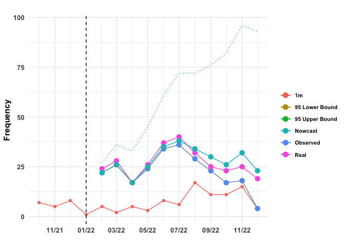<!-- -->
\## Reserve Estimates and Summary

``` r
# Calculate reserve estimates
nowcast_r <- rowSums(pred_median[49:60, ], na.rm = TRUE) * 4.35
real_r <- rowSums(test[49:60, ], na.rm = TRUE) * 4.35
paid_r <- rowSums(breach[49:60, -1], na.rm = TRUE) * 4.35

# Summary table
reserve_summary <- data.frame(Estimated = nowcast_r, Paid = paid_r, IBNR = nowcast_r - paid_r, Real = real_r)
print(reserve_summary)
```

    ##    Estimated   Paid  IBNR   Real
    ## 49    113.10 113.10  0.00 113.10
    ## 50     95.70  95.70  0.00 104.40
    ## 51    113.10 113.10  0.00 121.80
    ## 52     73.95  73.95  0.00  73.95
    ## 53    108.75 104.40  4.35 113.10
    ## 54    152.25 147.90  4.35 160.95
    ## 55    165.30 156.60  8.70 174.00
    ## 56    147.90 126.15 21.75 139.20
    ## 57    130.50 100.05 30.45 108.75
    ## 58    113.10  73.95 39.15 100.05
    ## 59    139.20  78.30 60.90 108.75
    ## 60    100.05  17.40 82.65  82.65
